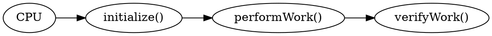
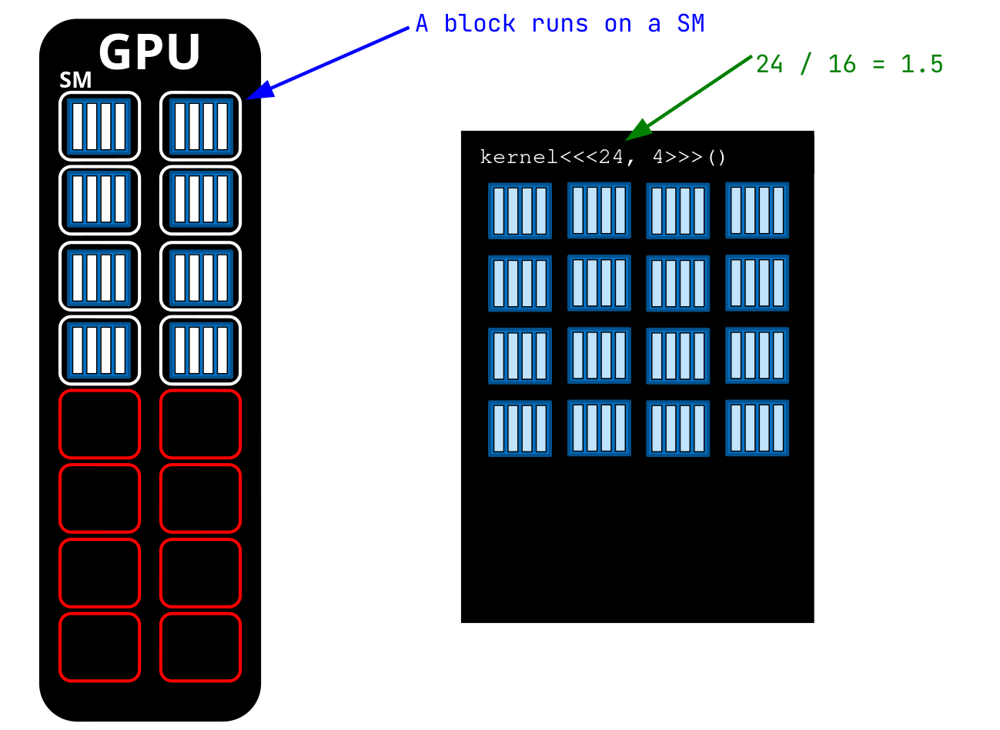
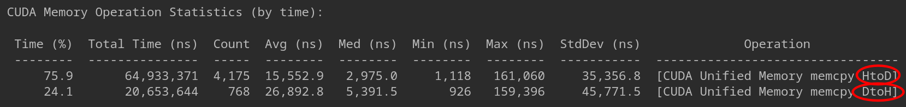
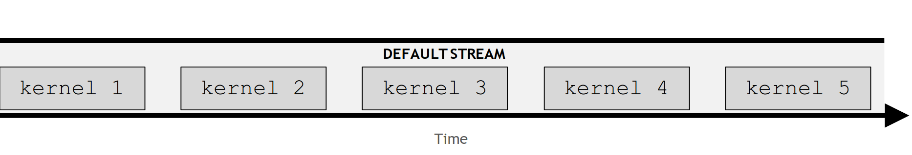
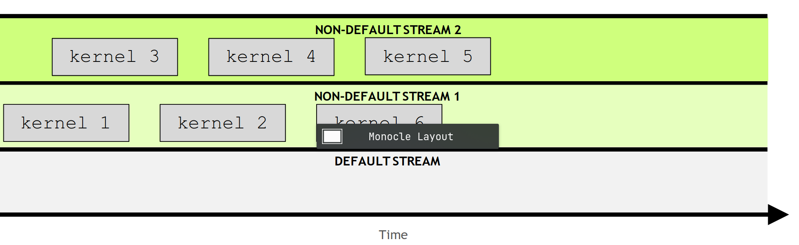
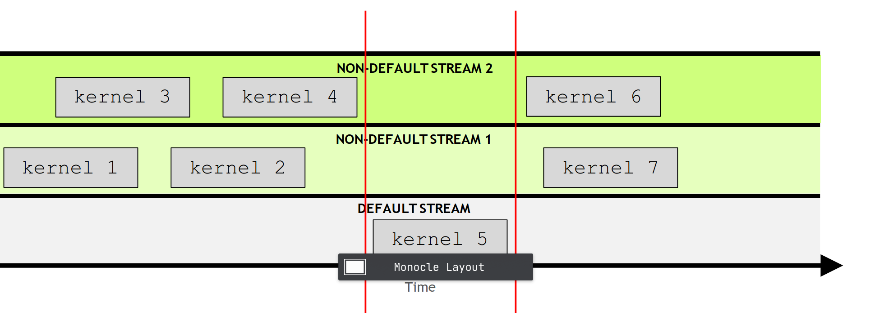
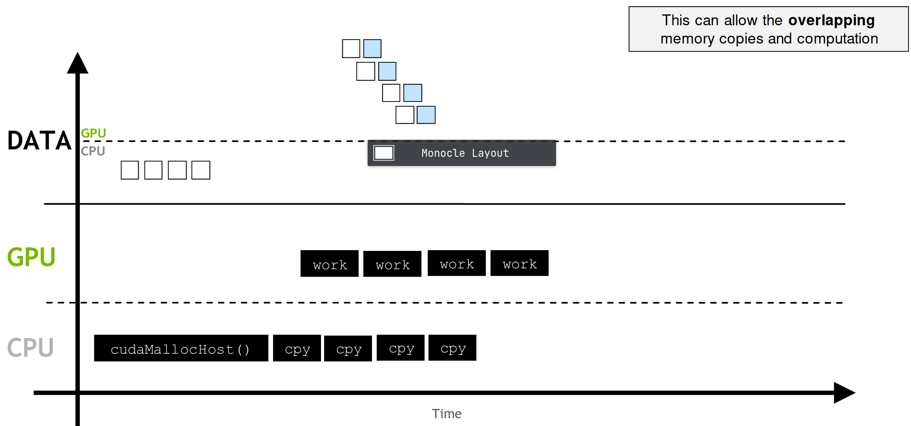

###### Taking from the Power Point Notes of the Course of Fundamentals of Accelerated Computing with CUDA C/C++ from the Deep Learning Institute (NVIDIA)
# Glossary
* **Host Code:** Is the code that is executed by the CPU
* **Device Code:** Is the code that is running on the GPU
# GPU-accelerated vs. CPU-only Applications
- Data is allocated in CPU and work is done by CPU

- Data is allocated with `cudaMallocManaged()`
```dot
digraph G {
    rankdir="LR"

  subgraph cluster_0 {
    style=filled;
    color=lightgrey;
    node [style=filled,color=white];
    "initialize()" -> "cpuWork()" -> Synchronize -> "verifyWork()";
    label = "CPU";
  }

  subgraph cluster_1 {
    style=filled;
    color=lightgrey;
    node [style=filled,color=white];
    "performWork()" -> Synchronize 
    label = "GPU";
  }
}
  }
```
- Work on the GPU is **asynchronous**, and CPU can work at the same time
- The CPU code can sync with the asynchronous GPU work, waiting for it to complete, with `cudaDeviceSynchronize()`
- Data access by the CPU will automatically be migrated from the GPU to CPU
- **Host Code** : is the code that

# CUDA Kernel Execution

- CUDA functions are called **kernels**, example the function:
```c
performWork<<2, 4>>(),
```
has as **execution configuration**: `<<2, 4>>` which specifies the number of blocks and threads in this case $2$ and $4$. All of this are in a configuration called grid which can contain in principle several blocks.


## CUDA-Provided Thread Hierarchy Variables
- `gridDim.x` : returns the number of blocks in the grid
- `blockIdx.x` : returns the index of the current block within the grid
- `blockDim.x` : returns the number of threads in a block 
- `threadIdx.x` : returns the index of a thread in a block
- All blocks in a grid contain the same number of threads

## Coordinating Parallel Threads
- There is a limit to the number of threads that can exist in a thread block: 1024 to be precise. In order to increase the amount of parallelism in accelerated applications, we must be able to coordinate among multiple thread blocks
- Assume that **data** is a 0-indexed vector:

- Each thread has only access to the size of its block via: `blockDim.x`, block index within the grid via: `blockIdx.x` and its own index within its block via: `threadIdx.x`
- The formula to match each thread to one element of the 0-vector is:

```c
vectorIndex = threadIdx.x + (blockIdx.x * blockDim.x)
```


## Grid Size Work Amount Mismatch
- Attempting to access non-existent elements can result in a runtime error

- The code must check that the `dataIndex` calculated by `threadIdx.x` + `blockIdx * blockDim.x` is less than `N`, the number of data elements

## Grid-Stride Loops
- Often there are more data elements than there are threads in the grid, in such a scenarios threads cannot work on only one element or else work is left undone 


- This problem can be addressed programmatically by using the **grid-stride loop**: Meaning the thread then strides forward by the number of threads in the grid: `blockDim.x * gridDim.x`

- In this way all elements are covered

- CUDA runs as many blocks in parallel at once as the GPU hardware supports, this allows massive parallelization


## Allocating Memory to be accessed on the GPU and the CPU
More recent versions of CUDA (version 6 and later) have made it easy to allocate memory that is available to both the CPU host and any number of GPU devices, and while there are many intermediate and advanced techniques for memory management that will support the most optimal performance in accelerated applications, the most basic CUDA memory management technique we will now cover supports fantastic performance gains over CPU-only applications with almost no developer overhead.
- [memory optimization link](https://docs.nvidia.com/cuda/cuda-c-best-practices-guide/index.html#memory-optimizations)

To allocate and free memory, and obtain a pointer that can be referenced in both host and device code, replace calls to malloc and free with cudaMallocManaged and cudaFree as in the following example:
```c
// CPU-only

int N = 2<<20;
size_t size = N * sizeof(int);

int *a;
a = (int *)malloc(size);

// Use `a` in CPU-only program.

free(a);

// Accelerated

int N = 2<<20;
size_t size = N * sizeof(int);

int *a;
// Note the address of `a` is passed as first argument.
cudaMallocManaged(&a, size);

// Use `a` on the CPU and/or on any GPU in the accelerated system.

cudaFree(a);

```

## Error Handling
- As in any application, error handling in accelerated CUDA code is essential. Many, if not most CUDA functions (see, for example, the memory management functions) return a value of type `cudaError_t`, which can be used to check whether or not an error occurred while calling the function. Here is an example where error handling is performed for a call to `cudaMallocManaged`:
```c
cudaError_t err;
err = cudaMallocManaged(&a, N)                    // Assume the existence of `a` and `N`.

if (err != cudaSuccess)                           // `cudaSuccess` is provided by CUDA.
{
  printf("Error: %s\n", cudaGetErrorString(err)); // `cudaGetErrorString` is provided by CUDA.
}
```
- Launching kernels, which are defined to return void, do not return a value of type `cudaError_t`. To check for errors occurring at the time of a kernel launch, for example if the launch configuration is erroneous, CUDA provides the cudaGetLastError function, which does return a value of type `cudaError_t`.
```c
/*
 * This launch should cause an error, but the kernel itself
 * cannot return it.
 */

someKernel<<<1, -1>>>();  // -1 is not a valid number of threads.

cudaError_t err;
err = cudaGetLastError(); // `cudaGetLastError` will return the error from above.
if (err != cudaSuccess)
{
  printf("Error: %s\n", cudaGetErrorString(err));
}
```
- Finally, in order to catch errors that occur asynchronously, for example during the execution of an asynchronous kernel, it is essential to check the status returned by a subsequent synchronizing CUDA runtime API call, such as cudaDeviceSynchronize, which will return an error if one of the kernels launched previously should fail.

### Cuda Error Handling Function
- It can be helpful to create a macro that wraps CUDA function calls for checking errors. Here is an example,
```c
#include <stdio.h>
#include <assert.h>

inline cudaError_t checkCuda(cudaError_t result)
{
  if (result != cudaSuccess) {
    fprintf(stderr, "CUDA Runtime Error: %s\n", cudaGetErrorString(result));
    assert(result == cudaSuccess);
  }
  return result;
}

int main()
{

/*
 * The macro can be wrapped around any function returning
 * a value of type `cudaError_t`.
 */

  checkCuda( cudaDeviceSynchronize() )
}
```

# Managing Accelerated Application Memory with CUDA Unified Memory and Nsight Systems (nsys)
## Streaming Multiprocessors
- NVIDIA GPUs contain functional units called: **Streaming Multiprocessors** or **SMs**
- Blocks of threads are scheduled to run on SMs
- Depending on the number of SMs on a GPU, and the requirements of a block, more than one block can be scheduled on an SM
- Grid dimensions divisible by the number of SMs on a GPU can promote full SM utilization. Otherwise one will have fallow SMs:

- On the image above the Kernel has 24 blocks in the grid. Will use the 16 SMs of the GPU the first call and in the second time will only use 8 having the other 8 without use (fallow)
- The GPUS that CUDA applications run on have processing units called **streaming multiprocessors**, or **SMs**. During kernel execution of threads are given to SMs to execute. In order to support the GPU's ability to perform as many parallel operations as possible, performance gains can often be had by choosing a grid size that has a number of blocks that is a multiple of the number of SMs on a given GPU.
- Additionally, SMs create, manage, schedule, and execute groupings of 32 threads from within a block called **warps**. A more in depth coverate of SMs and warps can be found [here](https://docs.nvidia.com/cuda/cuda-c-programming-guide/index.html#hardware-implementation)
- It is important to know that performance gains can also be had by choosing a block size that has a number of threads that is a multiple of 32

## Programmatically Querying GPU Device Properties
- In order to support portability, since the number of SMs on a GPU can differ depending on the specific GPU being used, the number of SMs should not be hard-coded into a code bases. Rather, this information should be acquired programatically.

- The following shows how, in CUDA C/C++, to obtain a C struct which contains many properties about the currently active GPU device, including its number of SMs:

```c
int deviceId;

cudaGetDevice(&deviceId);                  // `deviceId` now points to the id of the currently active GPU.

cudaDeviceProp props;
cudaGetDeviceProperties(&props, deviceId); // `props` now has many useful properties about
                                           // the active GPU device.
```
- To get other hardware properties of your GPU architecture refer to the following documentation: [CUDA Runtume Docs](https://docs.nvidia.com/cuda/cuda-runtime-api/structcudaDeviceProp.html)

## Unified Memory Behavior

- You have been allocating memory intended for use either by host or device code with cudaMallocManaged and up until now have enjoyed the benefits of this method - automatic memory migration, ease of programming - without diving into the details of how the Unified Memory (UM) allocated by `cudaMallocManaged` actual works.

- `nsys` profile provides details about UM management in accelerated applications, and using this information, in conjunction with a more-detailed understanding of how UM works, provides additional opportunities to optimize accelerated applications.

- When UM is allocated, the memory is not resident yet on either the host or the device. When either the host or device attempts to access the memory, a [page fault](https://en.wikipedia.org/wiki/Page_fault) will occur, at which point the host or device will migrate the needed data in batches. Similarly, at any point when the CPU, or any GPU in the accelerated system, attempts to access memory not yet resident on it, page faults will occur and trigger its migration.

- The ability to page fault and migrate memory on demand is tremendously helpful for ease of development in your accelerated applications. Additionally, when working with data that exhibits sparse access patterns, for example when it is impossible to know which data will be required to be worked on until the application actually runs, and for scenarios when data might be accessed by multiple GPU devices in an accelerated system with multiple GPUs, on-demand memory migration is remarkably beneficial.

- There are times - for example when data needs are known prior to runtime, and large contiguous blocks of memory are required - when the overhead of page faulting and migrating data on demand incurs an overhead cost that would be better avoided.

- Much of the remainder of this lab will be dedicated to understanding on-demand migration, and how to identify it in the profiler's output. With this knowledge you will be able to reduce the overhead of it in scenarios when it would be beneficial.

### Page Fault
- In computing, a **page fault** sometimes called **PF** or **hard fault** is an exception that the memory management unit (MMU) raises when a process accesses a memory page without proper preparations. Accessing the page requires a mapping to be added to the process's **virtual address space**. This process requires the page contents to be loaded from a backing store, such as disk. The MMU detects the page fault, but the OS Kernel handles the exception by making the required page accessible in the physical memory or denying an illegal memory access
- Valid page faults are common and necessary to increase the amount of memory available to programs in any operating system that utilizes virtual memory, such as Windows, macOS, and the Linux kernel
- There are three types of page faults: Minor, Major and Invalid
- Page faults degrade system performance and can cause thrashing.

## Evidence of Memory Migration using Nsight Systems (nsys)
- One is able to detect memory migrations when we look at the report given by
```bash
nsys profile --stats=true <path/to/binary>
```
- Looking at the CUDA Memory Operation Statistics (by time or by size). Then we could look for entries with the Operation description as either HtoD or DtoH, which then will imply that we have memory migration. Example:


## Asynchronous Memory Prefetching
- A powerful technique to reduce the overhead of page faulting and on-demand memory migrations, both in host-to-device and device-to-host memory transfers, is called asynchronous memory prefetching. Using this technique allows programmers to asynchronously migrate unified memory (UM) to any CPU or GPU device in the system, in the background, prior to its use by application code. By doing this, GPU kernels and CPU function performance can be increased on account of reduced page fault and on-demand data migration overhead.
- Prefetching also tends to migrate data in larger chunks, and therefore fewer trips, than on-demand migration. This makes it an **excellent fit when data access needs are known before runtime, and when data access patterns are not sparse**.

## Concurrent CUDA Streams
- A stream is a series of instructions, and CUDA has a **default stream**
- By default, CUDA kernels run in the default stream, which are executed in order (serially)

- However, kernels in **different, non-default streams**, can interact concurrently

- The default stream is special: **it blocks all kernels in all other streams**


## Non-Unified Memory 
- Memory can be allocated directly to the GPU with `cudaMalloc` and directly to the host with `cudaMallocHost`. Memory allocated in either of these ways can be **copied** to other locations in the system with `cudaMemCpy`.
- Copying leaves to copies in the system

## cudaMemcpyAsync
- `cudaMemcpyAsync` can asynchronously transfer memory over a non-default stream. This can allow the **overlapping** memory copies and computation


---
# Cuda Optimization Check List

1. `nsys-ui` : open the gui Nsight Systems application for visualization performance
2. Study the code to be subjected to optimization. What tasks run in parallel? What tasks run in serial? If there are already present optimizations, are there page faults present during Kernel execution with Unified Memory HtoD or DtoH?
3. `cudaPrefetchAsync(value, size, deviceId)` : apply prefetch to avoid page faults.
4. Initialize your variables in separate Kernel whenever possible, by doing so you can completely ditch HtoD transfers!
5. Prefetch `DtoH`, to avoid page faults whenever evaluations are performed
6. Implement non-default streams for tasks that do not require serial execution, and implement your serial tasks in the default stream. The default stream will automatically halt all tasks in running on non-default-streams until completion
