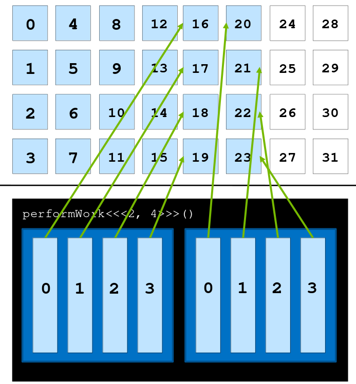

###### Taking from the Power Point Notes of the Course of Fundamentals of Accelerated Computing with CUDA C/C++ from the Deep Learning Institute (NVIDIA)
# Glossary
* **Host Code:** Is the code that is executed by the CPU
* **Device Code:** Is the code that is running on the GPU
# GPU-accelerated vs. CPU-only Applications
- Data is allocated in CPU and work is done by CPU

- Data is allocated with `cudaMallocManaged()`
```dot
digraph G {
    rankdir="LR"

  subgraph cluster_0 {
    style=filled;
    color=lightgrey;
    node [style=filled,color=white];
    "initialize()" -> "cpuWork()" -> Synchronize -> "verifyWork()";
    label = "CPU";
  }

  subgraph cluster_1 {
    style=filled;
    color=lightgrey;
    node [style=filled,color=white];
    "performWork()" -> Synchronize 
    label = "GPU";
  }
}
  }
```
- Work on the GPU is **asynchronous**, and CPU can work at the same time
- The CPU code can sync with the asynchronous GPU work, waiting for it to complete, with `cudaDeviceSynchronize()`
- Data access by the CPU will automatically be migrated from the GPU to CPU
- **Host Code** : is the code that

# CUDA Kernel Execution

- CUDA functions are called **kernels**, example the function:
```c
performWork<<2, 4>>(),
```
has as **execution configuration**: `<<2, 4>>` which specifies the number of blocks and threads in this case $2$ and $4$. All of this are in a configuration called grid which can contain in principle several blocks.


## CUDA-Provided Thread Hierarchy Variables
- `gridDim.x` : returns the number of blocks in the grid
- `blockIdx.x` : returns the index of the current block within the grid
- `blockDim.x` : returns the number of threads in a block 
- `threadIdx.x` : returns the index of a thread in a block
- All blocks in a grid contain the same number of threads

## Coordinating Parallel Threads
- There is a limit to the number of threads that can exist in a thread block: 1024 to be precise. In order to increase the amount of parallelism in accelerated applications, we must be able to coordinate among multiple thread blocks
- Assume that **data** is a 0-indexed vector:

- Each thread has only access to the size of its block via: `blockDim.x`, block index within the grid via: `blockIdx.x` and its own index within its block via: `threadIdx.x`
- The formula to match each thread to one element of the 0-vector is:

```c
vectorIndex = threadIdx.x + (blockIdx.x * blockDim.x)
```


## Grid Size Work Amount Mismatch
- Attempting to access non-existent elements can result in a runtime error

- The code must check that the `dataIndex` calculated by `threadIdx.x` + `blockIdx * blockDim.x` is less than `N`, the number of data elements

## Grid-Stride Loops
- Often there are more data elements than there are threads in the grid, in such a scenarios threads cannot work on only one element or else work is left undone 


- This problem can be addressed programmatically by using the **grid-stride loop**: Meaning the thread then strides forward by the number of threads in the grid: `blockDim.x * gridDim.x`

- In this way all elements are covered

- CUDA runs as many blocks in parallel at once as the GPU hardware supports, this allows massive parallelization


## Allocating Memory to be accessed on the GPU and the CPU
More recent versions of CUDA (version 6 and later) have made it easy to allocate memory that is available to both the CPU host and any number of GPU devices, and while there are many intermediate and advanced techniques for memory management that will support the most optimal performance in accelerated applications, the most basic CUDA memory management technique we will now cover supports fantastic performance gains over CPU-only applications with almost no developer overhead.
- [memory optimization link](https://docs.nvidia.com/cuda/cuda-c-best-practices-guide/index.html#memory-optimizations)

To allocate and free memory, and obtain a pointer that can be referenced in both host and device code, replace calls to malloc and free with cudaMallocManaged and cudaFree as in the following example:
```c
// CPU-only

int N = 2<<20;
size_t size = N * sizeof(int);

int *a;
a = (int *)malloc(size);

// Use `a` in CPU-only program.

free(a);

// Accelerated

int N = 2<<20;
size_t size = N * sizeof(int);

int *a;
// Note the address of `a` is passed as first argument.
cudaMallocManaged(&a, size);

// Use `a` on the CPU and/or on any GPU in the accelerated system.

cudaFree(a);

```

## Error Handling
- As in any application, error handling in accelerated CUDA code is essential. Many, if not most CUDA functions (see, for example, the memory management functions) return a value of type `cudaError_t`, which can be used to check whether or not an error occurred while calling the function. Here is an example where error handling is performed for a call to `cudaMallocManaged`:
```c
cudaError_t err;
err = cudaMallocManaged(&a, N)                    // Assume the existence of `a` and `N`.

if (err != cudaSuccess)                           // `cudaSuccess` is provided by CUDA.
{
  printf("Error: %s\n", cudaGetErrorString(err)); // `cudaGetErrorString` is provided by CUDA.
}
```
- Launching kernels, which are defined to return void, do not return a value of type `cudaError_t`. To check for errors occurring at the time of a kernel launch, for example if the launch configuration is erroneous, CUDA provides the cudaGetLastError function, which does return a value of type `cudaError_t`.
```c
/*
 * This launch should cause an error, but the kernel itself
 * cannot return it.
 */

someKernel<<<1, -1>>>();  // -1 is not a valid number of threads.

cudaError_t err;
err = cudaGetLastError(); // `cudaGetLastError` will return the error from above.
if (err != cudaSuccess)
{
  printf("Error: %s\n", cudaGetErrorString(err));
}
```
- Finally, in order to catch errors that occur asynchronously, for example during the execution of an asynchronous kernel, it is essential to check the status returned by a subsequent synchronizing CUDA runtime API call, such as cudaDeviceSynchronize, which will return an error if one of the kernels launched previously should fail.

### Cuda Error Handling Function
- It can be helpful to create a macro that wraps CUDA function calls for checking errors. Here is an example,
```c
#include <stdio.h>
#include <assert.h>

inline cudaError_t checkCuda(cudaError_t result)
{
  if (result != cudaSuccess) {
    fprintf(stderr, "CUDA Runtime Error: %s\n", cudaGetErrorString(result));
    assert(result == cudaSuccess);
  }
  return result;
}

int main()
{

/*
 * The macro can be wrapped around any function returning
 * a value of type `cudaError_t`.
 */

  checkCuda( cudaDeviceSynchronize() )
}
```
